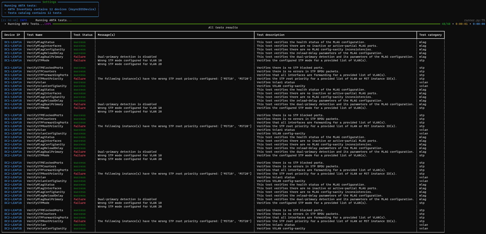

# Execute NRFU testing

All the NRFU testing commands are placed under `anta nrfu` and provide different rendering options:

- Table view
- JSON view
- Text view

```bash
anta nrfu
Usage: anta nrfu [OPTIONS] COMMAND [ARGS]...

  Run NRFU against inventory devices

Options:
  --help  Show this message and exit.

Commands:
  json   ANTA command to check network state with JSON result
  table  ANTA command to check network states with table result
  text   ANTA command to check network states with text result
```

All of these commands require the following input:

- A path to a catalog of tests to execute (`--catalog`)
- A list of tags if they are part of your inventory (`--tags`). List is comma separated


## NRFU with text rendering

This rendering is a pure text report for every test run on all devices. It comes with some options:

- Search (`--search`) for a regexp pattern in hostname and test name
- Option to skip (`--skip-error`) tests in error (not failure) because of a connectivity issue or unsupported command

Example output

```bash
$ anta nrfu text --tags pod1 --catalog nrfu/leaf.yml
leaf2 :: VerifyMlagStatus :: SUCCESS
leaf2 :: VerifyMlagInterface :: SUCCESS
leaf2 :: VerifyMlagConfigSanity :: SUCCESS
leaf2 :: VerifyInterfaceUtilization :: SUCCESS
leaf2 :: VerifyInterfaceErrors :: SUCCESS
leaf2 :: VerifyInterfaceDiscards :: SUCCESS
leaf2 :: VerifyInterfaceErrDisabled :: SUCCESS
leaf2 :: VerifyInterfaceStatus :: SUCCESS
leaf2 :: VerifyStormControlDrop :: SKIPPED (VerifyStormControlDrop test is not supported on cEOSLab.)
leaf2 :: VerifyPortChannel :: SUCCESS
leaf2 :: VerifyIllegalLacp :: SUCCESS
leaf2 :: VerifyLoopbackCount :: FAILURE (Found 3 Loopbacks when expecting 2)
leaf2 :: VerifySvi :: SUCCESS
[...]
```

## NRFU with table report

This rendering prints results in a nice table supporting grep filtering. It comes with its own set of options:

- Search (`--search`) for a pattern in hostname and test name.
- Option to group (`--group-by`) and summarize results. You can group by `host` or `test`.

```bash
$ anta check table -t pod1 -c nrfu/cudi.yml
```

{ loading=lazy width="800" }

You can also group per host or per test to get a summary view in case of large setup

{ loading=lazy width="800" }

## NRFU with JSON output

This command is helpful to generate a JSON and then pass it to another tool for reporting for instance. Only one option is available to save output to a file (`--output`)

```bash
$ anta check json -t pod1 -c nrfu/leaf.yml
[
  {
    "name": "leaf2",
    "test": "VerifyMlagStatus",
    "result": "success",
    "messages": "[]"
  },
  {
    "name": "leaf2",
    "test": "VerifyMlagInterface",
    "result": "success",
    "messages": "[]"
  }
]
```